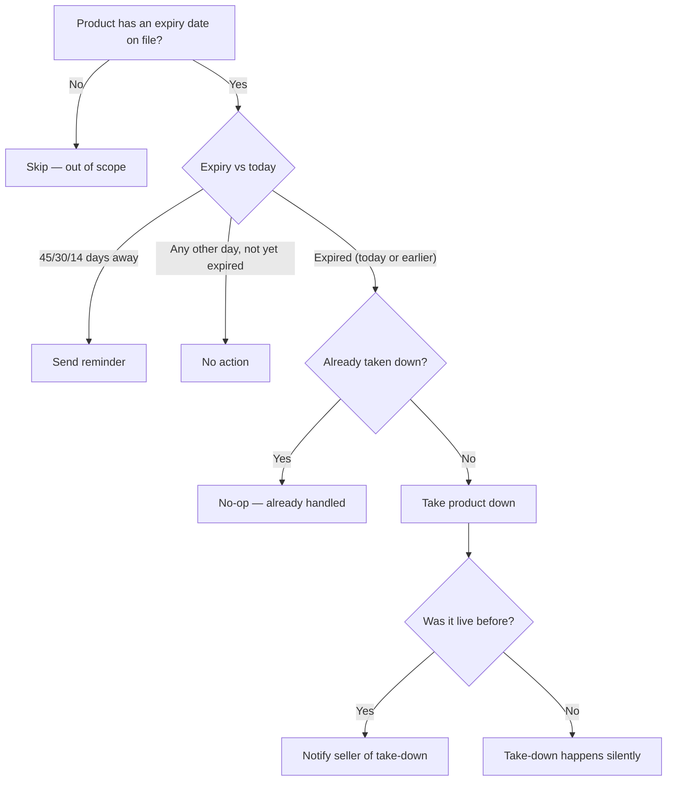

# Report: Daily NIE Expiration Check (Cron + Reminder + Freeze)

> Ticket    : GMRT-51524 · **Status: Approved**
> Author    : Anhar Solehudin (@anhsbolic)
> Version   : report v1 — generated from techplan v1, 2026-08-13
> Source    : `{TASK_PATH}/2-techplan/techplan.md` — regenerate this file if the source changes. Do not hand-edit independently.

---

## What & why

Every medical device (ALKES) and pharmaceutical (Obat) product has a government-issued license (NIE) that expires. Today nothing tracks that expiry in a way the system can act on — ALKES gets the date from a government API but doesn't store it queryably; Obat relies on the seller filling in a datepicker by hand. This adds a daily check that reminds sellers before their license expires and automatically takes the product down once it has.

## Scope

**Included**
- A daily automated check (00:01 WIB) that reminds sellers at 45, 30, and 14 days before expiry, then takes the product down on the day it expires.
- A one-time backfill of the expiry date for existing products already in the catalog (from government data for ALKES; from a stakeholder-provided spreadsheet for Obat).
- Reminders and take-down notifications delivered in-app only, reusing an existing notification workflow — no new notification channel is introduced.

**Explicitly not included this round**
- Automatically restoring a product after the seller renews its license — this only handles freezing on expiry.
- The separate "revoked" license case (a government-initiated revocation, not date-based) — that needs a different data signal and is a candidate for a future, similar addition.
- Any reminder channel besides in-app (no email, no WhatsApp).

## Architecture / Plan

Reminders fire on exact milestone days only — no window, no retry if a day is missed. Take-down fires on the expiry day itself and every day after, and is safe to run more than once without side effects.

**Components touched:**
| Component | Purpose |
|---|---|
| Product catalog data | Stores the expiry date and where it came from (government feed vs. seller-entered) |
| Daily scheduled check | Reads expiry dates, sends reminders, takes down expired products |
| Product update flow | Captures the expiry date going forward, for both product types |
| One-time backfill scripts | Populate the expiry date for products that already existed before this feature shipped |

**Not touched:** No public API changes, no changes to how products are otherwise created or edited.

## Key decisions

| Decision | Why |
|---|---|
| A product is taken down on its expiry day itself, not the day after | Re-confirmed against the requirements after an initial reading suggested a one-day grace period; there is none. |
| Any non-live status still gets frozen on expiry, not just actively-listed products | Regulatory requirement — accepted trade-off: sellers of already-inactive products aren't notified when this happens. |
| Reminders reuse an existing, already-live in-app notification workflow | Avoids introducing a new notification workflow for a simple one-line message + link. |
| The one-time backfill runs as separate manual scripts, not inside the database migration | Prevents a long-held database lock on a large table during deployment. |

## Risk requiring sign-off

| Risk | Exposure | Status |
|---|---|---|
| The very first run after backfill could freeze or notify a large batch of products at once | No pre-flight count or dry-run is planned — by design, this check runs silently | Accepted — operator monitors error logs if it fails |
| The new lookup column has no database index at launch | Could slow down the daily check once the product table is large | Deliberately deferred — will be measured against production data after the first real run |

## Open item(s) — needs your decision

- **Obat backfill spreadsheet not yet received from the stakeholder.** The one-time backfill script for existing Obat products can't be finalized until it arrives. Owner: Tech Lead / stakeholder.

## Sign-off

- [ ] Scope confirmed
- [ ] First-run batch spike and missing index accepted for this release
- [ ] Obat backfill spreadsheet dependency decided (or deferred with an owner noted)

---
*Full technical detail, rules, and implementation notes: see `{TASK_PATH}/2-techplan/techplan.md`.*